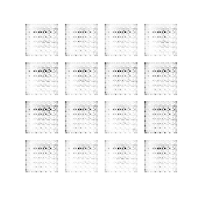
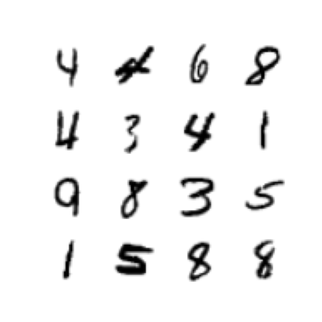
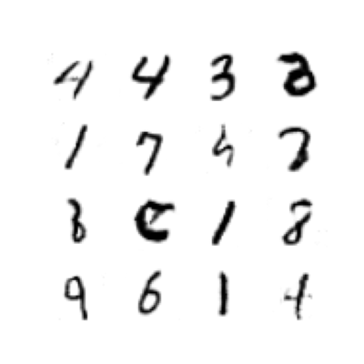

# DCGAN for MNIST digit generation

Tensorflow implementation of a Generative Adverserial Network (GAN) to
generate MNIST digits, using the new way to override `Model.train_step` in keras.

<p align="center">
    
</p>

## Results

<div align="center">
    <div>
        <h2>Training Images</h2> 
         
    </div>
    <div>
        <h2>Generated Images</h2> 
        
    </div>
</div>

## Install dependencies

Create a Python 3 virtual environment and activate it:

```bash
virtualenv -p python3 venv
source ./venv/bin/activate
```

Next, install the required dependencies:

```bash
pip install -r requirements.txt
```

## Train model

Start the model training by running:

```bash
python train.py
```

To track metrics, start `Tensorboard`

```bash
tensorboard --logdir path/to/log/dir
```

and then go to [localhost:6006](localhost:6006).
